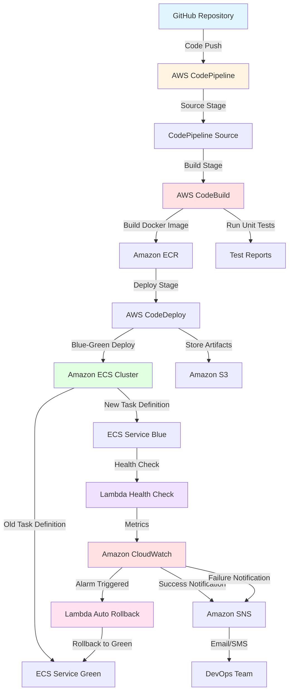

# Phoenix Pipeline - Self-Healing CI/CD Platform

A production-grade, enterprise-ready CI/CD pipeline with intelligent self-healing capabilities. Phoenix Pipeline automatically detects deployment failures and resurrects your previous stable version within seconds, ensuring zero-downtime deployments and maximum system reliability.

## Architecture Overview



## Project Structure

```
cicd-pipeline-project/
├── lambdas/
│   ├── health_check.py          # Performs health checks on deployed services
│   ├── auto_rollback.py         # Executes rollback on failure detection
│   └── requirements.txt         # Lambda dependencies
├── pipeline-config/
│   ├── buildspec.yml            # CodeBuild build instructions
│   ├── appspec.yml              # CodeDeploy deployment configuration
│   └── taskdef.json             # ECS task definition template
├── cloudformation/
│   ├── cicd-pipeline.yaml       # Main CI/CD pipeline stack
│   ├── ecs-cluster.yaml         # ECS cluster infrastructure
│   └── lambda-functions.yaml    # Lambda functions and IAM roles
├── sample-app/
│   ├── app.py                   # Simple Flask API application
│   ├── requirements.txt         # Application dependencies
│   ├── Dockerfile               # Container image definition
│   └── test_app.py              # Unit tests
├── README.md
└── .gitignore
```

## AWS Services Used

### Core Pipeline Services
- **AWS CodePipeline**: Orchestrates the entire CI/CD workflow across multiple stages
- **AWS CodeBuild**: Builds Docker images, runs tests, and creates deployment artifacts
- **AWS CodeDeploy**: Manages blue-green deployments to ECS with traffic shifting
- **Amazon ECR**: Stores Docker container images securely

### Compute and Container Services
- **Amazon ECS**: Runs containerized applications with auto-scaling capabilities
- **AWS Lambda**: Executes health checks and rollback logic serverlessly

### Monitoring and Notifications
- **Amazon CloudWatch**: Monitors application metrics, logs, and triggers alarms
- **Amazon SNS**: Sends deployment notifications and alerts to the team

### Storage and Infrastructure
- **Amazon S3**: Stores build artifacts and deployment packages
- **AWS CloudFormation**: Manages infrastructure as code for reproducible deployments

## How the Pipeline Works

### Stage 1: Source
1. Developer pushes code to GitHub repository
2. CodePipeline detects the change via webhook
3. Source code is downloaded and passed to the build stage

### Stage 2: Build
1. CodeBuild starts a build environment from the buildspec.yml
2. Application dependencies are installed
3. Unit tests are executed
4. Docker image is built and tagged
5. Image is pushed to Amazon ECR
6. Build artifacts are stored in S3

### Stage 3: Deploy
1. CodeDeploy retrieves the new Docker image from ECR
2. New ECS task definition is created with the updated image
3. Blue-green deployment is initiated
4. New tasks (Blue) are launched alongside existing tasks (Green)
5. Load balancer gradually shifts traffic to Blue environment
6. Health check Lambda function monitors the new deployment

### Stage 4: Validation
1. Lambda health check function runs every 1 minute
2. Checks application endpoints for HTTP 200 responses
3. Validates response time and error rates
4. Publishes custom metrics to CloudWatch

### Stage 5: Automated Decision
**Success Path:**
- All health checks pass for 5 consecutive minutes
- CloudWatch alarm stays in OK state
- Green environment is terminated
- SNS sends success notification
- Deployment completes

**Failure Path:**
- Health checks fail or timeout occurs
- CloudWatch alarm triggers ALARM state
- Auto-rollback Lambda is invoked
- Traffic is shifted back to Green environment
- Blue environment is terminated
- SNS sends failure notification with details
- Previous stable version continues running

## Setup Instructions

### Prerequisites
- AWS Account with appropriate permissions
- AWS CLI configured
- GitHub account and repository
- Python 3.9 or higher
- Docker installed locally

### Step 1: Create S3 Bucket for Artifacts
```bash
aws s3 mb s3://cicd-pipeline-artifacts-<your-account-id> --region us-east-1
```

### Step 2: Create ECR Repository
```bash
aws ecr create-repository --repository-name sample-python-app --region us-east-1
```

### Step 3: Deploy ECS Cluster Stack
```bash
aws cloudformation create-stack \
  --stack-name ecs-cluster-stack \
  --template-body file://cloudformation/ecs-cluster.yaml \
  --capabilities CAPABILITY_IAM \
  --region us-east-1
```

Wait for the stack to complete (approximately 5 minutes).

### Step 4: Deploy Lambda Functions Stack
```bash
# Package Lambda functions
cd lambdas
zip -r health_check.zip health_check.py
zip -r auto_rollback.zip auto_rollback.py
aws s3 cp health_check.zip s3://cicd-pipeline-artifacts-<your-account-id>/
aws s3 cp auto_rollback.zip s3://cicd-pipeline-artifacts-<your-account-id>/
cd ..

# Deploy stack
aws cloudformation create-stack \
  --stack-name lambda-functions-stack \
  --template-body file://cloudformation/lambda-functions.yaml \
  --capabilities CAPABILITY_IAM \
  --parameters ParameterKey=ArtifactBucket,ParameterValue=cicd-pipeline-artifacts-<your-account-id> \
  --region us-east-1
```

### Step 5: Create SNS Topic for Notifications
```bash
aws sns create-topic --name cicd-deployment-notifications --region us-east-1

# Subscribe your email
aws sns subscribe \
  --topic-arn arn:aws:sns:us-east-1:<account-id>:cicd-deployment-notifications \
  --protocol email \
  --notification-endpoint your-email@example.com
```

Confirm the subscription via the email you receive.

### Step 6: Set Up GitHub Connection
```bash
# Create a GitHub OAuth token with repo permissions
# Then create the connection in AWS Console:
# CodePipeline > Settings > Connections > Create connection
# Select GitHub and authorize
```

### Step 7: Deploy CI/CD Pipeline Stack
```bash
aws cloudformation create-stack \
  --stack-name cicd-pipeline-stack \
  --template-body file://cloudformation/cicd-pipeline.yaml \
  --capabilities CAPABILITY_IAM \
  --parameters \
    ParameterKey=GitHubRepo,ParameterValue=your-username/your-repo \
    ParameterKey=GitHubBranch,ParameterValue=main \
    ParameterKey=GitHubConnectionArn,ParameterValue=<connection-arn> \
  --region us-east-1
```

### Step 8: Push Code to GitHub
```bash
git init
git add .
git commit -m "Initial commit: CI/CD pipeline setup"
git branch -M main
git remote add origin https://github.com/your-username/your-repo.git
git push -u origin main
```

The pipeline will automatically trigger and deploy your application.

## Monitoring and Validation

### View Pipeline Execution
```bash
aws codepipeline list-pipeline-executions --pipeline-name sample-app-pipeline
```

### Check ECS Service Status
```bash
aws ecs describe-services \
  --cluster sample-app-cluster \
  --services sample-app-service
```

### View CloudWatch Logs
```bash
# Health check logs
aws logs tail /aws/lambda/health-check-function --follow

# Application logs
aws logs tail /ecs/sample-app --follow
```

### Monitor Metrics in CloudWatch
1. Navigate to CloudWatch console
2. Go to Alarms section
3. View the deployment health alarm status
4. Check custom metrics under "AWS/ECS" namespace

## Testing the Rollback Mechanism

### Simulate a Failed Deployment

1. Modify `sample-app/app.py` to return errors:
```python
@app.route('/health')
def health():
    return "Error", 500  # This will trigger rollback
```

2. Commit and push changes:
```bash
git add sample-app/app.py
git commit -m "Test rollback mechanism"
git push origin main
```

3. Observe the pipeline:
   - Build completes successfully
   - Deployment starts
   - Health checks fail
   - Alarm triggers after 2 failed checks
   - Rollback Lambda automatically reverts to previous version
   - SNS notification sent

4. Verify rollback:
```bash
aws ecs describe-services \
  --cluster sample-app-cluster \
  --services sample-app-service \
  --query 'services[0].deployments'
```

## Configuration Parameters

### Environment Variables
- `ENVIRONMENT`: Deployment environment (dev/staging/prod)
- `HEALTH_CHECK_INTERVAL`: Frequency of health checks (default: 60 seconds)
- `ALARM_THRESHOLD`: Number of failed checks before rollback (default: 2)
- `DEPLOYMENT_TIMEOUT`: Maximum deployment duration (default: 900 seconds)

### Customization Options
- Modify `buildspec.yml` to add additional build steps
- Update `appspec.yml` to change deployment hooks
- Adjust CloudWatch alarm thresholds in CloudFormation templates
- Configure different traffic shifting strategies in CodeDeploy

## Cost Estimation

Approximate monthly costs for this setup (us-east-1):

- CodePipeline: $1 per active pipeline
- CodeBuild: $0.005 per build minute (approximately $5-10/month)
- ECS Fargate: $0.04048 per vCPU hour + $0.004445 per GB hour (approximately $30-50/month)
- Lambda: First 1M requests free, then $0.20 per 1M requests
- CloudWatch: $0.30 per custom metric, $0.50 per 1M logs ingested
- ECR: $0.10 per GB storage per month
- S3: $0.023 per GB storage

**Total estimated monthly cost: $40-70 for a small production workload**

## Troubleshooting

### Pipeline Fails at Build Stage
- Check CodeBuild logs in CloudWatch
- Verify Docker build context and Dockerfile syntax
- Ensure all dependencies are listed in requirements.txt

### Deployment Hangs
- Check ECS task logs for application errors
- Verify security groups allow load balancer traffic
- Ensure task definition has correct IAM role

### Health Checks Failing
- Test the health endpoint manually
- Verify Lambda has network access to ECS tasks
- Check CloudWatch logs for health check Lambda

### Rollback Not Triggering
- Verify CloudWatch alarm is configured correctly
- Check Lambda function has proper IAM permissions
- Ensure SNS topic has active subscriptions

## Security Best Practices

1. **IAM Roles**: Use least privilege principle for all service roles
2. **Secrets Management**: Store sensitive data in AWS Secrets Manager
3. **Network Security**: Deploy ECS tasks in private subnets with NAT gateway
4. **Image Scanning**: Enable ECR image scanning for vulnerabilities
5. **Audit Logging**: Enable CloudTrail for all API calls
6. **Encryption**: Use encrypted S3 buckets and ECR repositories

## Performance Optimization

- Use multi-stage Docker builds to reduce image size
- Implement caching strategies in CodeBuild
- Configure appropriate ECS task sizes based on load testing
- Use Application Auto Scaling for ECS services
- Enable CloudWatch Container Insights for detailed metrics

## Cleanup

To delete all resources and avoid charges:

```bash
# Delete pipeline stack
aws cloudformation delete-stack --stack-name cicd-pipeline-stack

# Delete Lambda stack
aws cloudformation delete-stack --stack-name lambda-functions-stack

# Delete ECS stack
aws cloudformation delete-stack --stack-name ecs-cluster-stack

# Delete S3 bucket (after emptying it)
aws s3 rb s3://cicd-pipeline-artifacts-<your-account-id> --force

# Delete ECR repository
aws ecr delete-repository --repository-name sample-python-app --force

# Delete SNS topic
aws sns delete-topic --topic-arn arn:aws:sns:us-east-1:<account-id>:cicd-deployment-notifications
```

## License

This project is provided as-is for educational and professional development purposes.
